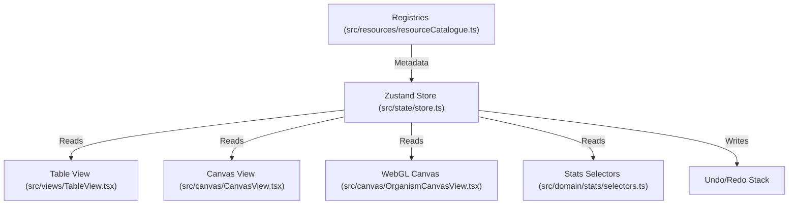

# MOOORF Essential Product Reuse Atlas

**Author:** Antigravity AI
**Role:** Independent Read-Only Auditor
**Production Base SHA:** `c4600472ea76f651800c19b91cf8f67954ca992e` (main)
**Branch:** `research/c0-fast-track-essential-product-atlas`

---

## Section 1: Live Provenance Inventory

The following table documents the origin, lineage, and structural status of all current branches and prototypes. Every head and base reference has been verified against origin.

| Branch Name | Head SHA | Base/Source SHA | Status Classification | Reuse/Porting Decision |
| :--- | :--- | :--- | :--- | :--- |
| `main` | `a0f7b33d4e13ad72d5203141d7688794ad377446` | `c4600472ea76f651` | **Production Base** | Single source of truth. All work must root here. |
| `feature/c0-4-1-layer-contracts-resolvers` | `c4600472ea76f651800c19b91cf8f67954ca992e` | `92f4c644a9f27a3b` | **Merged to Main** | Reused. Already merged into main base; forms the layer foundation. |
| `feature/c0-4f-a-runtime-layer-separation` | *Codex Active (Moving)* | `c4600472ea76f651` | **Planned Work Branch** | In-progress by Codex. Integrates layer rendering and stroke logic. |
| `design/c0-3-cell-inspector-v2-lab` | `462bf9bacbb1ee60015fc1e794539ab3b25f6b97` | `c4600472ea76f651` | **Design Prototype** | Selective Port / Reimplement. Do not merge wholesale. |
| `feature/c0-2-icon-grid-asset-registry` | `028c90541481b07a185e768fae921a7108a4e5d2` | `c4600472ea76f651` | **Audited Merge Candidate** | Direct Ingestion. Extracted registries must be ported to main. |
| `research/c0-2-symbol-asset-expansion` | `9aa52779deac12701ba30eed1ff6e919e88091f4` | `028c90541481b07a` | **Research-only** | Reference candidate manifest; do not merge code. |
| `status/antigravity` | `44e8bf7296cb25be551b7758a984fd628240c152` | `c4600472ea76f651` | **Status Tracker** | Direct Write (Status only). |
| `status/codex` | `e3e69025ebbce22686f5b674be5fe7f94fd69608` | `c4600472ea76f651` | **Status Tracker** | Read-only. |

### Divergent Ancestry & Merge Warning
> [!WARNING]
> Under no circumstances should prototype branches such as `design/c0-3-cell-inspector-v2-lab` or `design/c0-3-icons-symbols-inspector-lab` be merged wholesale into `main` or `feature/` branches. They use custom mock stores, bypass history logs, contain duplicate material lists, and fail production accessibility rules. Only selective UI layout and CSS tokens may be extracted.

---

## Section 2: Exact Ownership Map

The following map catalogs all production codebase subsystems, identifying their physical files, state bounds, and operational boundaries.



### 2.1 Master Graph & Space Cell Data
* **Exact Files:** [src/types.ts](file:///Users/tanisxq/Documents/ZONU0/src/types.ts) (`SpaceCell`), [src/domain/graph/types.ts](file:///Users/tanisxq/Documents/ZONU0/src/domain/graph/types.ts) (`SpaceNode`, `ZonuertProject`)
* **State Source:** Zustand store (`state.spaces`)
* **Consumers:** `OrganismCanvasView`, `CanvasView` (Classic), `TableView`, `ExportService`, `StatsSelectors`
* **Mutation Boundary:** Zustand actions: `addSpace`, `addVoid`, `updateSpace`, `removeSpace`, `applyLayoutPreset`
* **Persistence Boundary:** Saved view snapshot (`SavedCanvasSnapshot`), project recovery envelope (`localStorage`), export project JSON
* **History Boundary:** Commits via `commitSpaceTransform` (positions) and `commitSpaceEdit` (name/area/body text modifications)
* **Renderer/Export Implications:** Modifying a space cell's category or coordinates forces immediate rAF redraw and is captured in vector/raster exports
* **Stale/Duplicate Owners:** None. Product data is isolated.

### 2.2 Project Settings & Presentation Defaults
* **Exact Files:** [src/state/store.ts](file:///Users/tanisxq/Documents/ZONU0/src/state/store.ts) (`LabSettings`), [src/domain/presentation/defaults.ts](file:///Users/tanisxq/Documents/ZONU0/src/domain/presentation/defaults.ts), [src/domain/presentation/resolveAppearance.ts](file:///Users/tanisxq/Documents/ZONU0/src/domain/presentation/resolveAppearance.ts)
* **State Source:** Zustand store (`state.settings`)
* **Consumers:** `OrganismCanvasView`, `CanvasView` (Classic), `ExportService`, `WidgetFrame` (density calculation)
* **Mutation Boundary:** `setSettings`, `setWidgetScale`, `setOrganism`
* **Persistence Boundary:** Snapshot Envelope (`SavedCanvasSnapshot`), `settings.presentationDefaults`
* **History Boundary:** Excluded from the transform history stack; saved view restore is the only undo boundary
* **Renderer/Export Implications:** Drives active shader variables and layer visibility maps (Boundary styles, Core sizes, Shadow parameters)
* **Stale/Duplicate Owners:** None.

### 2.3 Selection & Temporary Editing State
* **Exact Files:** [src/interaction/selection.ts](file:///Users/tanisxq/Documents/ZONU0/src/interaction/selection.ts), [src/canvas/InlineCellEditor.tsx](file:///Users/tanisxq/Documents/ZONU0/src/canvas/InlineCellEditor.tsx)
* **State Source:** Zustand store (`state.selectedIds`, `state.primarySelectedId`, `state.contextSurface`)
* **Consumers:** `ContextSurfaceHost`, `SelectedCellCommandMenu`, canvas overlay rendering layers
* **Mutation Boundary:** `replaceSelection`, `toggleSelection`, `clearSelection`, `selectAllVisible`
* **Persistence Boundary:** Strictly transient. Never persisted in snapshots, local recovery envelopes, or project files
* **History Boundary:** Excluded from Undo/Redo transactions
* **Renderer/Export Implications:** Selected rings are rendered dynamically on screen; explicitly filtered out of exports
* **Stale/Duplicate Owners:** None.

### 2.4 Bounded Undo/Redo Transactions
* **Exact Files:** [src/state/store.ts](file:///Users/tanisxq/Documents/ZONU0/src/state/store.ts) (`transformUndoStack`, `transformRedoStack`)
* **State Source:** Zustand store arrays
* **Consumers:** Bottom dock shortcut keys, keyboard event listeners (`Cmd+Z` / `Cmd+Shift+Z`)
* **Mutation Boundary:** `commitSpaceTransform`, `undoSpaceTransform`, `redoSpaceTransform`, `commitSpaceEdit`
* **Persistence Boundary:** Cleared on project switch or page reload; never persisted
* **History Boundary:** This *is* the boundary. Capped at 50 entries
* **Renderer/Export Implications:** Triggers rAF repaint on undo/redo execution
* **Stale/Duplicate Owners:** None.

### 2.5 Classic Renderer
* **Exact Files:** [src/canvas/CanvasView.tsx](file:///Users/tanisxq/Documents/ZONU0/src/canvas/CanvasView.tsx), [src/canvas/renderer.ts](file:///Users/tanisxq/Documents/ZONU0/src/canvas/renderer.ts), [src/canvas/blob.ts](file:///Users/tanisxq/Documents/ZONU0/src/canvas/blob.ts)
* **State Source:** Read-only subscription to Zustand `spaces`, `camera`, and `settings`
* **Consumers:** Screen view when `settings.rendererMode === "classic"`
* **Mutation Boundary:** None. Pure render subscription
* **Persistence Boundary:** None
* **History Boundary:** None
* **Renderer/Export Implications:** Renders fallback canvas context; exports offscreen vector SVG
* **Stale/Duplicate Owners:** None.

### 2.6 Organism/WebGL Renderer
* **Exact Files:** [src/canvas/OrganismCanvasView.tsx](file:///Users/tanisxq/Documents/ZONU0/src/canvas/OrganismCanvasView.tsx), [src/canvas/organismAdapter.ts](file:///Users/tanisxq/Documents/ZONU0/src/canvas/organismAdapter.ts)
* **State Source:** Reads store `spaces` and runs GPU shaders with uniform buffers
* **Consumers:** Screen view when `settings.rendererMode === "organism"`
* **Mutation Boundary:** None. Pure subscriber
* **Persistence Boundary:** None
* **History Boundary:** None
* **Renderer/Export Implications:** Captures live framebuffer for high-res PNG/PDF export
* **Stale/Duplicate Owners:** None.

### 2.7 Cell Inspector & Widget Primitives
* **Exact Files:** [src/ui/widgets/](file:///Users/tanisxq/Documents/ZONU0/src/ui/widgets/) (WidgetHost, WidgetFrame, controls)
* **State Source:** Zustand store (`state.openWidgets`), local panel dimensions
* **Consumers:** Dashboard shell layers
* **Mutation Boundary:** `openWidget`, `closeWidget`, `focusWidget`
* **Persistence Boundary:** Panel position is cached locally during the session; saved view stores layout state
* **History Boundary:** Local layout edits do not push to the history stack
* **Renderer/Export Implications:** Never exported; excluded from offscreen captures
* **Stale/Duplicate Owners:** None.

### 2.8 Area & Radius Conversion
* **Exact Files:** [src/domain/graph/adapters.ts](file:///Users/tanisxq/Documents/ZONU0/src/domain/graph/adapters.ts)
* **State Source:** None (stateless math conversion)
* **Consumers:** `OrganismCanvasView`, `CanvasView` (Classic), `InlineCellEditor`
* **Mutation Boundary:** None
* **Persistence Boundary:** None
* **History Boundary:** None
* **Renderer/Export Implications:** Converts structural cell areas (m²) into physical rendering radii: `radius = Math.sqrt(area / Math.PI) * scale`
* **Stale/Duplicate Owners:** None.

### 2.9 Hit Testing & Drag Transforms
* **Exact Files:** [src/interaction/groupDrag.ts](file:///Users/tanisxq/Documents/ZONU0/src/interaction/groupDrag.ts), `OrganismCanvasView.tsx` (pointer down hit detection)
* **State Source:** Temporary local pointer coordinates
* **Consumers:** Canvas view interactive layers
* **Mutation Boundary:** Translates pointer deltas into canvas world coordinates
* **Persistence Boundary:** None
* **History Boundary:** Drag events are resolved locally; final commit triggers a single history push
* **Renderer/Export Implications:** Updates cell positions on screen in real-time during drag
* **Stale/Duplicate Owners:** None.

### 2.10 Table Data & Editing
* **Exact Files:** [src/views/TableView.tsx](file:///Users/tanisxq/Documents/ZONU0/src/views/TableView.tsx)
* **State Source:** Direct subscription to Zustand `spaces`
* **Consumers:** Split screen / Table Workspace
* **Mutation Boundary:** Zustand `updateSpace` action
* **Persistence Boundary:** Persists directly through the parent store
* **History Boundary:** Writes to the store history stack upon cell edit completion
* **Renderer/Export Implications:** Updates table rows; pushes updates instantly to the Canvas
* **Stale/Duplicate Owners:** None.

### 2.11 CSV/Excel/File Intake
* **Exact Files:** [src/import/](file:///Users/tanisxq/Documents/ZONU0/src/import/) (FileIntakeProvider, projectFiles, tableImport)
* **State Source:** Reads uploaded binary streams/strings
* **Consumers:** `FileIntakeWidget`
* **Mutation Boundary:** Parses streams and commits batch operations via one Zustand transaction
* **Persistence Boundary:** Restores active canvas, updates recovery snapshot
* **History Boundary:** Triggers a single undo action for the entire file import
* **Renderer/Export Implications:** Overwrites or merges cell records, updating canvas layout
* **Stale/Duplicate Owners:** None.

### 2.12 Project Save/Load/Recovery
* **Exact Files:** [src/import/projectTransfer.ts](file:///Users/tanisxq/Documents/ZONU0/src/import/projectTransfer.ts), store persistence middlewares
* **State Source:** reads JSON files or `localStorage`
* **Consumers:** Loader sequence, File Drawer
* **Mutation Boundary:** Atomic replacement of Zustand store state
* **Persistence Boundary:** Auto-save recovery caches
* **History Boundary:** Clears undo history upon complete project reload
* **Renderer/Export Implications:** Completely updates the stage
* **Stale/Duplicate Owners:** None.

### 2.13 Floor Entities & Filtering
* **Exact Files:** Planned for C2.3 (not yet implemented)
* **State Source:** Will bind to a new store slice `state.floors`
* **Consumers:** Canvas rendering, Table view filtering, derived stats
* **Mutation Boundary:** Will use floor actions (`addFloor`, `setFloorVisibility`)
* **Persistence Boundary:** `SavedCanvasSnapshot` and export files
* **History Boundary:** Will push to the history stack upon layout updates
* **Renderer/Export Implications:** Filters visible cells on the canvas; exports visible layers only
* **Stale/Duplicate Owners:** None.

### 2.14 Derived Selectors & Statistics
* **Exact Files:** [src/domain/stats/selectors.ts](file:///Users/tanisxq/Documents/ZONU0/src/domain/stats/selectors.ts)
* **State Source:** Pure selectors over Zustand `state.spaces`
* **Consumers:** `ProjectPulseWidget`, family stats widgets, Data Health panel
* **Mutation Boundary:** None. Pure computed functions
* **Persistence Boundary:** None
* **History Boundary:** None
* **Renderer/Export Implications:** Computes programmatic totals and derived ratios (FAR, ground coverage)
* **Stale/Duplicate Owners:** None.

### 2.15 Dashboard/Widget Rendering
* **Exact Files:** [src/ui/widgets/stats/](file:///Users/tanisxq/Documents/ZONU0/src/ui/widgets/stats/) (ProjectPulseWidget, primitives)
* **State Source:** Subscription to stats selectors
* **Consumers:** Spatial Intelligence panels
* **Mutation Boundary:** None. UI view only
* **Persistence Boundary:** None
* **History Boundary:** None
* **Renderer/Export Implications:** Renders metrics; completely excluded from exports
* **Stale/Duplicate Owners:** None.

### 2.16 Relationships & Connections
* **Exact Files:** Planned for C0.10 (not yet implemented)
* **State Source:** Will read a new store slice `state.relationships`
* **Consumers:** Canvas view, export services, stats panels
* **Mutation Boundary:** Will use actions (`addRelationship`, `updateRelationship`)
* **Persistence Boundary:** Snapshot, project save
* **History Boundary:** Undoable transaction stack
* **Renderer/Export Implications:** Renders connection lines between cell anchors; exports connection vectors
* **Stale/Duplicate Owners:** None.

### 2.17 PNG/SVG/PDF/Project Export
* **Exact Files:** [src/export/](file:///Users/tanisxq/Documents/ZONU0/src/export/) (exportService, canvasComposite, pdfExport, csv, manifest)
* **State Source:** Captures active state from store
* **Consumers:** ExportWidget
* **Mutation Boundary:** None. Read-only capture
* **Persistence Boundary:** Writes outputs to downloads
* **History Boundary:** None
* **Renderer/Export Implications:** Produces physical files; excludes active canvas cursors, selection UI, and widgets
* **Stale/Duplicate Owners:** None.

### 2.18 Icon/Grid/Annotation/Material Registries
* **Exact Files:** [src/icons/iconRegistry.ts](file:///Users/tanisxq/Documents/ZONU0/src/icons/iconRegistry.ts), [src/grid/gridRegistry.ts](file:///Users/tanisxq/Documents/ZONU0/src/grid/gridRegistry.ts), [src/annotations/annotationRegistry.ts](file:///Users/tanisxq/Documents/ZONU0/src/annotations/annotationRegistry.ts), [src/materials/materialRegistry.ts](file:///Users/tanisxq/Documents/ZONU0/src/materials/materialRegistry.ts), [src/resources/resourceCatalogue.ts](file:///Users/tanisxq/Documents/ZONU0/src/resources/resourceCatalogue.ts)
* **State Source:** Pure static lookup objects
* **Consumers:** Resource Catalogue lookup calls, `PaletteWidget`, `DisplayWidget`
* **Mutation Boundary:** Read-only; cannot be mutated at runtime
* **Persistence Boundary:** Static registry objects are never persisted; only resource IDs are saved
* **History Boundary:** None
* **Renderer/Export Implications:** Translates IDs to colors/geometry; unknown references fall back safely
* **Stale/Duplicate Owners:** None.

---

## Section 3: Prototype Reuse Audit

We have performed a complete architectural audit of the Cell Inspector V2 design prototype on branch `origin/design/c0-3-cell-inspector-v2-lab` at head `462bf9bacbb1ee60015fc1e794539ab3b25f6b97`.

```text
PROTOTYPE INGESTION SCHEME
├── REUSE_AS_IS: CSS tokens and custom range inputs
├── ADAPT: Inspector layout structure, search logic
├── SELECTIVE_PORT: Sliders, backing configuration
├── REIMPLEMENT: Double-click inline editor, history
└── REJECT: Mock store state and hard-coded values
```

### 3.1 Content Tab
* **Classification:** `ADAPT`
* **Rationale:** The visual presentation of space name, area, and body is correct and fits the 330px layout. However, typography presets must read from the production default schema rather than mock strings, and the Text Size slider must write to a unified CSS scale variable, not local element state.

### 3.2 Symbol Tab
* **Classification:** `SELECTIVE_PORT`
* **Rationale:** The search input, category filters, and grid rendering can be ported. Placement sliders (scale, rotation, offset) and backing configurations (circle, outline, offset) are visually excellent but must be re-bound to write to the `spaces[id].appearance` override map in production.

### 3.3 Cell Style Tab
* **Classification:** `SELECTIVE_PORT`
* **Rationale:** Boundary offset, width, dash style, and Core options must connect to C0.4.1 presentation targets. The "Open Material Browser" action is accepted, but the direct color picker must be tied to the active palette.

### 3.4 Double-Click Inline Editing
* **Classification:** `REIMPLEMENT`
* **Rationale:** The prototype's inline editor is a mock element. Production already has a fully functional inline editor in [src/canvas/InlineCellEditor.tsx](file:///Users/tanisxq/Documents/ZONU0/src/canvas/InlineCellEditor.tsx). We must extend this existing production editor to support the "Body" field, committing edits through the production `commitSpaceEdit` store action to ensure table/canvas synchronization.

### 3.5 Selection Orbit
* **Classification:** `ADAPT`
* **Rationale:** The dotted rotating orbit looks premium, but it must be written as a lightweight WebGL shader overlay or a clean canvas layer rather than a resource-intensive DOM element wrapped in an SVG path wrapper. Reduced-motion flags must disable the CSS rotation animations.

### 3.6 Floating Panel Layout
* **Classification:** `ADAPT`
* **Rationale:** The inspector panel layout should be integrated into the production floating widget framework, using `WidgetFrame` and `WidgetHost` to maintain position, z-index ordering, and minimizing features.

### 3.7 Grid & Backing Controls
* **Classification:** `SELECTIVE_PORT`
* **Rationale:** The backing type (none / circle / auto contrast circle) and alignment rules are approved. Auto contrast backing must evaluate color luminance to select `#FFFFFF` or `#222222` dynamically without rendering delay.

### 3.8 Search & Category Filter
* **Classification:** `ADAPT`
* **Rationale:** The search text matches name and tags. The horizontal scrollable chips container matches design requirements, but the scrollbar must be styled invisibly to match production rules.

### 3.9 Recents & Favourites
* **Classification:** `SELECTIVE_PORT`
* **Rationale:** Local storage logic in the prototype must be replaced by a clean, persistent cookies/localStorage helper that works alongside `ResourceCatalogue`.

### 3.10 Copy & Paste Style
* **Classification:** `REIMPLEMENT`
* **Rationale:** The copy-paste action in the prototype is a shallow object copy. Production requires deep copying of the `appearance` sub-object of `SpaceCell` while explicitly omitting content properties (`name`, `area`, `kind`, `id`, `category`, `privacy`). Paste operations must execute as a single atomic transaction in the store's history stack.

---

## Section 6: Data-Flow and State-Preservation Analysis

This section analyzes five critical data flows to prevent regressions like duplicate state or out-of-sync views.

### 6.1 Cell Inspector Edit Flow
```text
Cell Inspector UI Input -> commitSpaceEdit Action -> Zustand state.spaces update
      |
      +-> TableView updates automatically
      +-> Canvas redraws labels (rAF)
      +-> TransformStack logs snapshot (Undo/Redo frame)
      +-> SaveCurrentView pushes view to localStore
      +-> ExportService includes changes in PNG/PDF
```
* **Regression Risks:**
  1. *Stale selector cache:* If canvas views memoize space properties individually rather than subscribing to the array, text changes will not render.
  2. *Duplicate inputs:* If the inline editor maintains local state that doesn't sync with the Inspector input, editing one will leave the other stale.
* **Mitigation:** Binding both controls to subscribe directly to the selected cell's record via the main store.

### 6.2 Area Edit Flow
```text
Inspector Area Slider -> updateSpace Action -> Math.sqrt(area/PI)*scale -> Radius -> Canvas
      |
      +-> TableView Area cell updates
      +-> UndoStack records position transform
      +-> Export capture renders correct cell dimensions
```
* **Regression Risks:**
  1. *Non-numeric typing:* Entering non-numeric strings in the input can trigger NaN coordinates.
  2. *Circular loops:* Canvas drag recalculates coordinate positions, which must not trigger area recalculation.
* **Mitigation:** Sanitize and clamp all numeric inputs to a minimum of 1 m²; keep coordinate translation independent of area logic.

### 6.3 Table Bulk Edit Flow
```text
Table Column Select -> updateSpace on N Cells -> Derived selectors update -> Stats widgets
      |
      +-> Canvas redraws all cell sizes and category colors
      +-> UndoStack records one atomic multi-cell transaction
```
* **Regression Risks:**
  1. *Store thrashing:* Committing updating actions in a loop inside the component triggers N separate renders.
  2. *History bloat:* Multi-cell edits could push N separate history frames.
* **Mitigation:** Batch bulk updates into a single store action that commits all space cell overrides in one transaction.

### 6.4 Floor Change Flow
```text
Floor Active Level selector -> setFloorVisibility -> Canvas filters visible cells
      |
      +-> Stats selectors exclude invisible floors (as per layout parameters)
      +-> TableView updates rows list
      +-> ExportService prints active floor only
```
* **Regression Risks:**
  1. *Muted cells counted:* Hidden cells might still add to statistics.
  2. *Lost selections:* Cells on hidden floors must not remain active.
* **Mitigation:** Filter stats selectors based on active floor visibility; clear selection of any cell that becomes hidden.

### 6.5 Relationship Edit Flow
```text
Radial Connection tool -> addRelationship -> Graph node validation -> Store update
      |
      +-> Canvas renderer draws vector line between cell borders
      +-> Stats selectors count active links
```
* **Regression Risks:**
  1. *Orphan edges:* Deleting a cell must automatically prune its relationships.
  2. *Visual loops:* Recalculating lines on every mouse movement can cause layout lag.
* **Mitigation:** Implement cascade-delete in the store; calculate line endpoints dynamically in the render pass.

---

## Section 7: Performance and Complexity Budget

This section outlines the performance constraints of the ZONUERT canvas interface.

### 7.1 Bottlenecks for 50+ Cells
* **Current Limit:** Canvas lagging is observed when rendering more than 50 cells due to repeated DOM styling calculations.
* **Analysis:** Organism WebGL draw calls are efficient (one pass), but DOM-based label rendering and selection orbits trigger reflows.
* **Action:** Keep labels isolated in a dedicated overlay layer; throttle pointer translation.

### 7.2 High-Frequency Selectors
* **Risk:** Selectors like `selectCategoryMix` or `selectPrivacyBalance` recalculate on every camera pan.
* **Mitigation:** Selectors must subscribe to the `spaces` array reference only, memoizing values to prevent recalculation on zoom/pan events.

### 7.3 Render-Loop Overhead
* **Risk:** Running physics or motion calculations on every frame drains battery.
* **Mitigation:** Limit active rAF cycles to user-triggered drag or zoom actions; freeze rendering when the canvas is idle.

### 7.4 History Snapshot Cost
* **Risk:** Storing complete clones of 96 cells in the undo stack consumes memory.
* **Mitigation:** Store only sparse delta positions `{ id, before: {x,y}, after: {x,y} }` rather than cloning the entire state.

### 7.5 Import Normalization Cost
* **Risk:** Parsing large CSV files with 200+ rows freezes the main thread.
* **Mitigation:** Run parsing asynchronously; batch cell insertions into chunks.

---

## Section 8: Asset and Registry Integration Plan

This plan defines the process for importing new symbols using the audited C0.2 icon registry.

```text
SYMBOL INGESTION PIPELINE
[Audited Candidate Manifest]
      │
      ├── Ingest 15 Essential Symbols (Utensils, Briefcase, Toilet, Users, etc.)
      │     └── Map Lucide keys to namespaced IDs
      │
      ├── Load 14 Aliases (wc -> toilet, work -> office, etc.)
      │     └── Prevent geometry duplication
      │
      └── Design 8 Custom SVG Vectors (sinks, wardrobes, etc.)
            └── Store as clean inline paths
```

### 8.1 Ingestion Plan
We will ingest the 15 essential symbols identified in the C0.2 expansion study:
* **Architecture:** `Utensils` (dining), `Briefcase` (office), `Store` (retail), `Package` (storage), `WashingMachine` (utility), `Toilet` (washroom), `ShowerHead` (shower), `Users` (meeting).
* **Furniture:** `Table` (table).
* **Safety:** `Lock` (restricted), `FireExtinguisher` (fire), `AlarmSmoke` (smoke).
* **Wayfinding:** `Road` (road).
* **Diagram:** `Link` (relationship).

### 8.2 Ingesting Aliases
We will define alias maps in [src/icons/iconRegistry.ts](file:///Users/tanisxq/Documents/ZONU0/src/icons/iconRegistry.ts) to map terms (e.g. `wc` to `toilet`, `work` to `office`, `restroom` to `toilet`) without duplicating SVG definitions.

### 8.3 Custom Vectors
The 8 custom plan symbols (e.g., specific architectural wardrobes, double sinks, technical dimension ticks) will be stored as custom SVG path strings in the registry, avoiding external file assets.

### 8.4 UI Icons vs. Drawable Symbols
* **UI Command Icons:** Dashboard interface icons (Close, Zoom, Pin, Drawer) belong in the design shell UI.
* **Drawable Symbols:** Plan icons belong in the static registry. They are never mixed.
